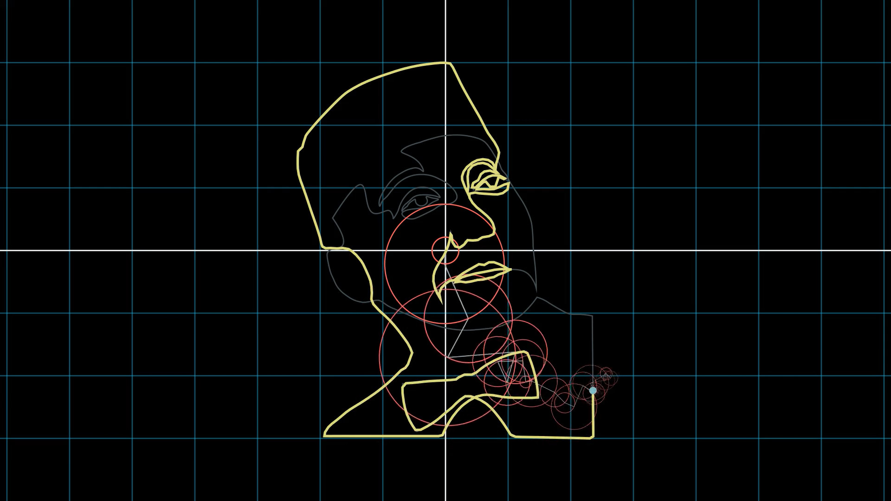

# The Visual Culture of the Nation of Islam

A monorepo of [Manim](https://www.manim.community) scripts which draw
animations to compliment talks on the art of the Nation of Islam, and
particularly, that of its newspapers, _Muhammad Speaks_ and _Bilalian News_.



## Dependencies

This project uses Python 3.13, and is managed via
[`uv`](https://docs.astral.sh/uv). To install `uv`,
* on Windows, run
  ```powershell
  powershell -ExecutionPolicy ByPass -c "irm https://astral.sh/uv/install.ps1 | iex"
  ```
* or on Unix, run
  ```bash
  curl -LsSf https://astral.sh/uv/install.sh | sh
  ```
or see
[the installation page](https://docs.astral.sh/uv/getting-started/installation)
for package manager availability.

> [!NOTE]
> `pip` should work, but is untested. This project uses `uv build` as the
> backend for speed's sake, which `pip` can be used to manage, if desired.

The project also depends on,
* `cairo (1.18.4)`,
* `cmake (3.31.7)`,
* `gpac (2.4)`,
* and `pkg-config (0.29.2)`.

The program is developed with the parenthesized versions, but lower versions may
work.

Then, to clone the project, and to install a virtual environment which will run
the project, run
```bash
git lfs install # We use LFS to store binary assets, i.e., images and audio.
git clone https://github.com/thoughtpatterns/vcnoi
cd vcnoi

# If you use a non-POSIX-compliant shell, `uv` will offer the correct command
# with which to source the virtual environment, i.e., "Activate with: <command>".
uv venv
source .venv/bin/activate # For POSIX-compliant shells.

uv sync # Installs each requisite package to the virtual environment.
```

If you use [`nix`](https://nixos.wiki/wiki/Nix_package_manager) with
[`direnv`](https://direnv.net), a `flake.nix` is provided, which pulls
`python313`, `uv`, and the library dependencies listed above, then sources the
virtual environment as you enter the project directory.

## Quick Start

See `./CONTRIBUTE.md` to find a (short) style guide, and how to begin a new
presentation.

## License

The source code of this project is licensed under the GPL-3.0 license — see
the LICENSE file for details.

With regards to assets we created,
* each image of the _Muhammad Speaks_ or _Bilalian News_ newspapers _is_ free
  for reuse,
* each other images (e.g., presentation slides) _is not_ available for reuse,
* and voiceover audio _is not_ available for reuse.

Otherwise,
* the _Computer Modern_ font is used with the SIL Open Font License,
* and each music track is used via a noncommercial open license.

The images in each presentation can be found in that presentation's
`./assets/works.yaml` file. The [Khamseen](https://sites.lsa.umich.edu/khamseen)
presentations, `pacchikari_in_agra` and `rashid_al_din`, instead cite their
works in their respective final slides.
